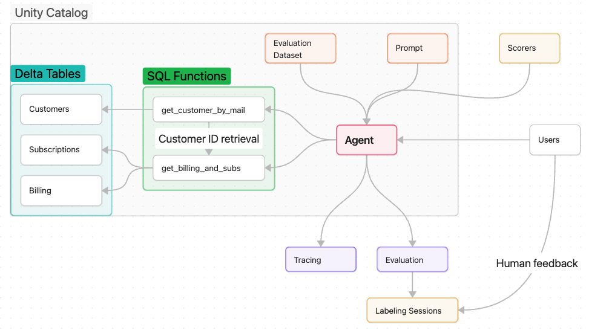

## Criação de agentes com Databricks
- Demonstração simplificada de principais funcionalidades para criação de agentes usando Databricks
- Adaptações necessárias estão marcadas com `TODO:`
- Essa é uma versão simplificada [dessa demo](https://www.databricks.com/resources/demos/tutorials/data-science/ai-agent?itm_data=demo_center)
#### setup:
- Definição de funções usadas pelo agente
- Download de 3 tabelas usadas na demo
- Uso de `ai_query` para simular perguntas
#### driver:
- Notebook adaptado e simplificado gerado a partir do Playground
- Demonstra features de log e registro de modelos no MLflow, avaliação, criação de labeling sessions, registro de prompts, definição e utilização de scorers
- Obs: é necessário criar um scorer manualmente via UI na aba do experimento associado ao modelo devido à demonstração de scorers na célula 14
#### Arquitetura

